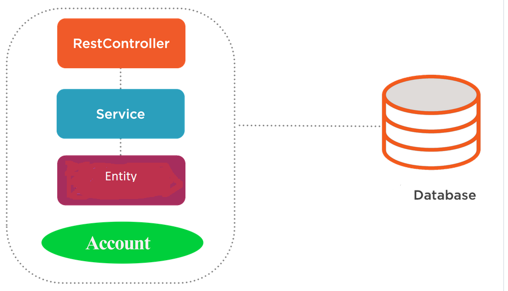
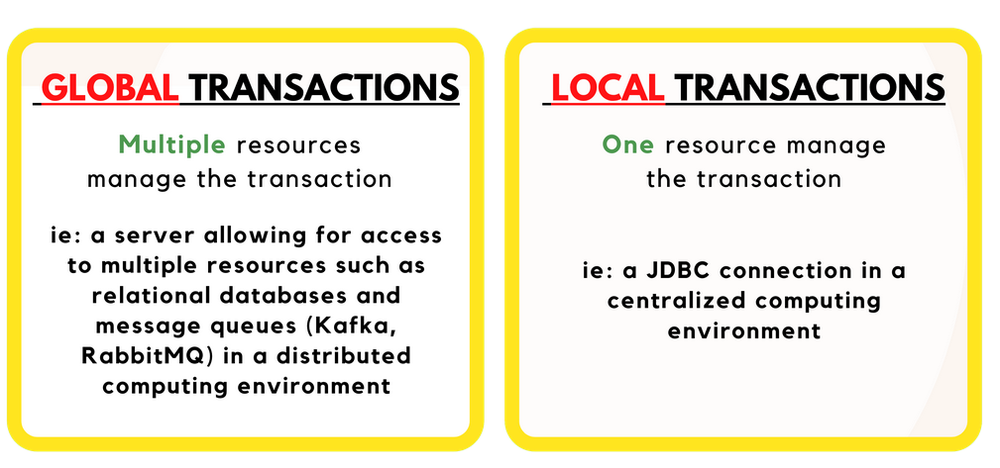
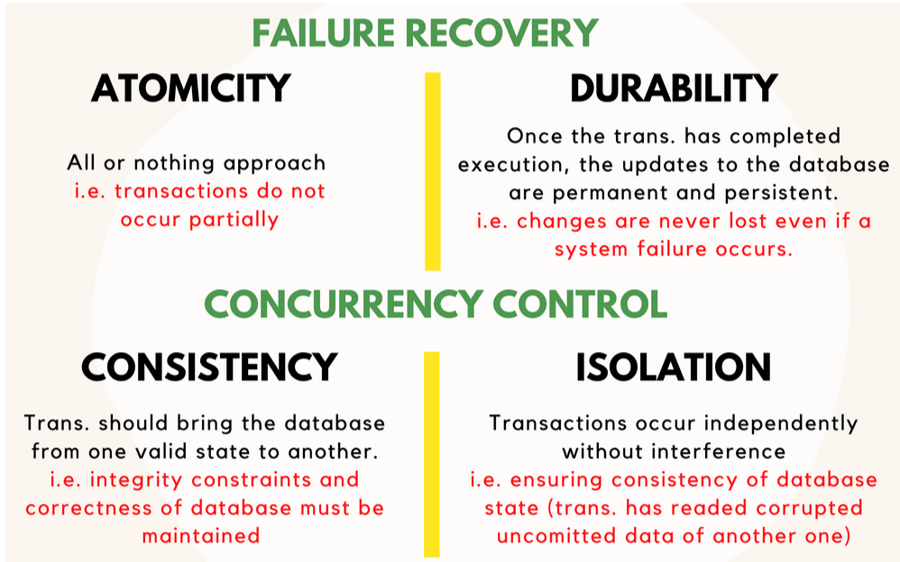
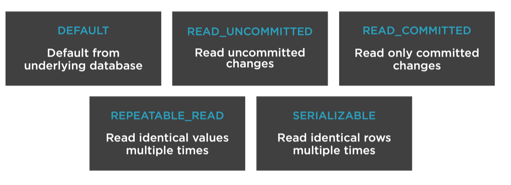
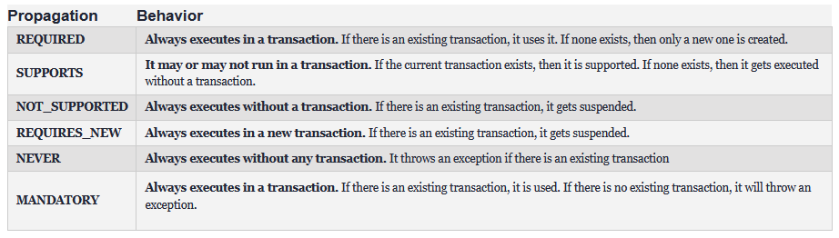

### Project
- Money Tranfer Spring Boot API for declarative and programmatic transaction management.
- Add Transaction Management information in ```About Spring Transactions``` section.

## Architecture
- 

## Prerequisites
- Spring Boot (2.5.10)
- Maven 
- Java (1.8)
- Libraries:
  * starter-web 
  * starter-data-jpa
  * mysql-db
  * lombok
  * ModuleMapper
  
## Start application (maven/IDE)
- Install the necessary project dependencies:$ ./mvnw install
- To run the Application from the Command Line: $ ./mvnw clean spring-boot:run
- To build a deployable jar file for local development, if preferred:$ ./mvnw clean package

## Swagger
- The application has swagger 2 integrated. Access the swagger:
-[Swagger Local URL](http://localhost:9091/swagger-ui.html)


- Call API (http://localhost:9091/service/accounts) to add few accounts or update DB (supplied SQL).
```SQL:title=data.sql
INSERT INTO account_info (id, acct_number, balance, name, rate)
VALUES (1, 11111, 200,  'Alex', 0.035);

INSERT INTO account_info (id, acct_number, balance, name, rate)
VALUES (2, 22222, 200,  'James', 0.035);
```

- Test showcase:

```java
Example to showcase the consistency is: 
**_Money Tranfer of 100 from Alex to James_**.
Before the transaction:

**Alex's account balance**: 200.
**James's account balance**: 200.

=> **Total**: **_400_**.

After the transaction:
**Alex's account balance**: 100.

**James's account balance**: 300.
=> **Total**: **_400_**.
```

## About Spring Transactions

- There are two types of transactions:
- 

* 1. Global transaction
- They're used when multiple resources manage trx, can span multiple transactional resources i.e an application server allowing for access to many relational databases and message queues.
- Global transaction management is required in a distributed computing environment where all the resources are distributed across multiple systems. In such a case, transaction management needs to be done both at local and global levels. A distributed or a global transaction is executed across multiple systems, and its execution requires coordination between the global transaction management system and all the local data managers of all the involved systems.

* 2. Local transaction
- Local transaction management can be useful in a centralized computing environment where application components and resources are located at a single site, and transaction management only involves a local data manager running on a single machine. Local transactions are easier to be implemented that's why they's our case in the TransferMoney Spring Boot application.


## ACID properties

- All transactions processing systems must implement:
* Failure recovery (Atomicity, Durability).
* Concurrency control (Isolation, Consistency).

- The ACID properties, in totality, provide a mechanism to ensure correctness and consistency of a database in a way such that each transaction is a group of operations that acts a single unit, produces consistent results, acts in isolation from other operations and updates that it makes are durably stored.
- 

* (a) Atomicity
- By this, we mean that either the entire transaction takes place at once or doesn’t happen at all. There is no midway i.e. transactions do not occur partially. Each transaction is considered as one unit and either runs to completion or is not executed at all.

* (b) Consistency
- This means that integrity constraints must be maintained so that the database is consistent before and after the transaction. It refers to the correctness of a database. Referring to the example above, let's say that we have a rule or a bank supervision standard that limits the daily transactions to 500000, so we'll surely have a database check constraint for this. This rule must be maintained before and after the transaction, let's suppose this is a method that enable a money tranfer

* (c) Isolation
- This property ensures that multiple transactions can occur concurrently without leading to the inconsistency of database state. Transactions occur independently without interference. Changes occurring in a particular transaction will not be visible to any other transaction until that particular change in that transaction is written to memory or has been committed.
- Isolation mailnly help avoid those kind of problems:
* Dirty reads
* Non-repeatable reads
* Phantom reads 
- Read more about that [here](<https://en.wikipedia.org/wiki/Isolation_(database_systems)#Read_phenomena>).

* (d) Durability
- This property ensures that once the transaction has completed execution, the updates and modifications to the database are stored in and written to disk and they persist even if a system failure occurs.These updates now become permanent and are stored in non-volatile memory, so the effects of the transaction, thus, are never lost.


# Spring Framework for transaction management
- When it comes to trans, spring provides a lot of advantages:

- Providing a consistent programming model across global and local transactions (by setting a uniform API across all different transaction & persistence APIs.)
- lightweight and flexible trans. management.
- Support for both programmatic & declarative trans. management.
- Extra support of springboot to transaction management.
- Benefits from different trans. management strategies.

- Spring’s Transactional annotation comes with additional configuration compared to its JTA counterpart:
* Isolation – Spring offers transaction-scoped isolation through the isolation property; however, in JTA, this feature is available only at a connection level
* Propagation – available in both libraries, through the propagation property in Spring, and the value property in Java EE; Spring offers Nested as an additional propagation type
* Read-Only – available only in Spring through the readOnly property
* Timeout – available only in Spring through the timeout property
* Rollback – both annotations offer rollback management; JTA provides the rollbackOn and dontRollbackOn properties, while Spring has rollbackFor and noRollbackFor, plus two additional properties: rollbackForClassName and noRollbackForClassName

- @Transactional Annotation: They are two separate package (make sure to use spring annotation package).
* Spring package:
```import org.springframework.transaction.annotation.Transactional;```
* JTA package:
```import javax.transaction.Transactional;```

* Isolation levels
- The Isolation from ACID properties, Spring supports isolation levels that help developers avoid problems that may arise when multiple transactions in the application are operating concurrently on the same data (concurrency control). Following are isolation levels:
-

* Propagation levels
Following are propagation levels:
-

## Transaction settings

```java:title=Propagation
@Transactional ( propagation = Propagation.REQUIRED )
//Code will always run in a transaction

@Transactional ( propagation = Propagation.REQUIRES_NEW )
//Code will always run in a new transaction

@Transactional ( propagation = Propagation.NEVER )
//Method shouldn’t be run within a transaction
```

```java:title=Isolation
@Transactional(isolation = Isolation.READ_UNCOMMITTED)
//Allows dirty reads
@Transactional(isolation = Isolation.READ_COMMITTED)
//Does not allow dirty reads
@Transactional(isolation = Isolation.REPEATABLE_READ)
//Result always the same if row read twice
@Transactional(isolation = Isolation.SERIALIZABLE)
//Performs all transactions in a sequence
```

```java:title=Timeout
@Transactional( timeout=5 )
//Timeout for the operation wrapped by the transaction
```

```java:title=ReadOnly
@Transactional( read-only = true )
/**
=> Transactions don’t write back to database
=> Optimizes data access
=> Provides a hint to the persistence provider
=> Only relevant inside a transaction
*/
```
## Transaction management types
- Transaction management ensures data consistency and integrity, The spring supports both programmatic & declarative trans. management, and these are the two ways you handle and manage transactions.

* Declarative transaction management:
- An approach that allows the developer separates transaction management from business code, you start by setting your configuration XML based that uses XML files outside of the code or via Java annotations.
* Manage transactions via configuration.
* Separate transaction logic from business logic.
* Easy to maintain.
* Preferred when a lot of transaction logic.

* Programmatic transaction management:
- There is where developer writes custom code to manage the transaction and set boundaries.
* Explicitly coded transaction management.
* Manage transactions via code.
* Useful for minimal transaction logic.
* Flexible but difficult to maintain.
* Couples transaction and business logic.

## Declarative transaction vs. programmatic transaction
- It depends on your needs, personally i'm usually using the annotation config for handling my transactions the declarative way in 90% of cases, however when sometimes you need more control to your transaction, i mean you want to decide when exactly commit your changes or whatever, then spring provide you support for programmatic management as well, so you can be more flexible with your transaction, what you should know is in that case you'll have to couple trans. technical code and your business logic and this make things harder for you to maintain.

# Implementing declarative transaction management
* Without proxy: The method is invoked directly on that object reference
* With proxy: The default advice mode for processing `@Transactional` annotations is proxy.

* To summarize proxy uses

- `Transaction interceptor` which intercepts method calls.
- `Platform transaction manager` that handles transactions.

- At a high level, Spring creates proxies for all the classes annotated with @Transactional – either on the class or on any of the methods. The proxy allows the framework to inject transactional logic before and after the running method – mainly for starting and committing the transaction.

- 4 Components interacting with each other are used by spring to handle transaction:

- **_`Persistence context proxy`_**
* The entities live in database are managed by entity manager, it defines methods that are used to interact with persistence context.

- **_`Entity manager proxy`_**
* The database trans. happens inside the scope of a persistence context which is a set of managed entity instances that exist in a particular store (H2 in our case), it defines the scope for entity instances. (each enity manager is associated to a persistence context).

- **_`Transaction aspect`_**
* The intercept method calls with the annotation Transactional, what i should mention here is the interceptor is called before and after the method is invoked on the object reference (first call before to begin a transaction & second call after to commit changes), it has two main responsabilities, first determines if new trans needed, the other is determines decides when to commit, rollback or left running.

- **_`Transaction manager`_**
* it's an abstraction abstraction, represented in our case by Spring's [platform transcation manager](https://docs.spring.io/spring-framework/docs/current/javadoc-api/org/springframework/transaction/PlatformTransactionManager.html) interface, we are using actually the JPA transaction manager that provide essential methods for controlling trans operations at runtime like begin, commit, rollback.


* Spring recommends that you only annotate concrete classes.

